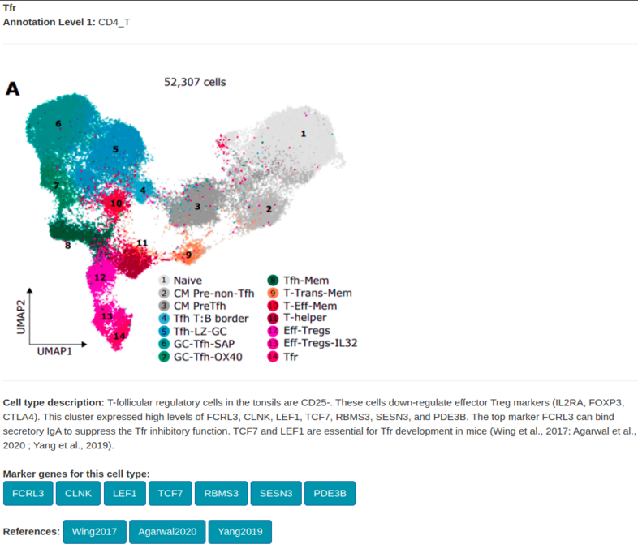

# HCATonsilData

<!-- badges: start -->
[](https://github.com/massonix/HCATonsilData/actions/workflows/R-CMD-check.yaml)
<!-- badges: end -->

HCATonsilData is an R/ExperimentHub package that provides easy access to
single-cell RNA-seq (scRNA-seq), single-cell ATAC-seq (scATAC-seq), 10X Multiome,
CITE-seq and spatial transcriptomics data (Visium) derived from the tonsil cell
atlas project.


## Citation

The preprint was published in June 2022:

[Massoni-Badosa, R., Soler-Vila, P., Aguilar-Fernández, S., Nieto, J. C., Elosua-Bayes, M., Marchese, D., ... & Heyn, H. (2022). An Atlas of Cells in the Human Tonsil. bioRxiv, 2022-06.](https://www.biorxiv.org/content/10.1101/2022.06.24.497299v1.abstract)

And the final paper was accepted in September 2023, so we expect it to be published
December of this year.


## Installation

HCATonsilData is available in BioConductor and can be installed as follows:

``` r
if (!require("BiocManager", quietly = TRUE))
    install.packages("BiocManager")

BiocManager::install("HCATonsilData")
```

Alternatively, you can install it from GitHub using the [devtools](https://github.com/hadley/devtools) package:

``` r
if (!require("devtools", quietly = TRUE))
    install.packages("devtools")

devtools::install_github("massonix/HCATonsilData", build_vignettes = TRUE)
```

## Documentation

HCATonsilData is a data package. As such, comprehensive documentation is an essential
component of the package, and we provide it through the package vignette:

``` {r}
browseVignettes("HCATonsilData")
```

## Requirements

HCATonsilData has two versions: version 1.0 corresponds to the first data
release that came out during the preprint. During the revision process, we
included 7 additional tonsils, and almost doubled the number of cells of the
atlas. We provide this data in version 2.0, which is the one associated with
the final publication.

The data for version 2.0 was uploaded to ExperimentHub just before the 3.18
release of BioConductor. Thus, you will need the release >= 3.18 of Bioconductor,
and R >= 4.3.0


## Basic usage

We provide access to `SingleCellExperiment` objects of the main cellular compartments
described in our manuscript. The function `listCellTypes` prints the available
cell types for a given assay (RNA, ATAC, CITE or Spatial):

``` {r}
listCellTypes(assayType = "RNA")
```
```
 [1] "All"        "NBC-MBC"    "GCBC"      
 [4] "PC"         "CD4-T"      "Cytotoxic" 
 [7] "myeloid"    "FDC"        "epithelial"
[10] "PDC" 
```

HCATonsilAtlas data allows to install scRNA-seq and spatial transcriptomics data
as SingleCellExperiments and SpatialExperiments, respectively. For scATAC-seq, 
Multiome, and CITE-seq we provide in the vignette the instructions on how to access
the data archived at [Zenodo](https://zenodo.org/record/8373756) 
Note that for now HCATonsilAtlas only provides access to RNA data, but we are
working hard to extend it to other modalities, which are/will be archived in 
[Zenodo](https://doi.org/10.5281/zenodo.6340174) as [Seurat objects](https://satijalab.org/seurat/).

To obtain the `SingleCellExperiment` object associated with a given cell type we use
the `HCATonsilData()` function:

``` {r}
(myeloid <- HCATonsilData(assayType = "RNA", cellType = "myeloid", version = "2.0"))
```
```
class: SingleCellExperiment 
dim: 37378 5334 
metadata(0):
assays(2): counts logcounts
rownames(37378): AL627309.1 AL627309.3 ... AC136616.1 AC023491.2
rowData names(3): gene_name highly_variable gene_id
colnames(5334): bw94nf57_vm85woki_AAAGTGACAAGGAGTC-1 bw94nf57_vm85woki_AAGCATCCACTAGTAC-1 ...
  zoxefjul_5m23u91h_TTAGCCTGTTCGGGAT-1 zoxefjul_5m23u91h_TTATTGCTCCTTAATC-1
colData names(39): barcode donor_id ... UMAP_1_20230508 UMAP_2_20230508
reducedDimNames(3): PCA UMAP HARMONY
mainExpName: NULL
altExpNames(0):
```
```{r}
library(patchwork)
p1 <- scater::plotUMAP(myeloid, colour_by = "annotation_20230508")
p2 <- scater::plotUMAP(myeloid, colour_by = "SELENOP")
p1 | p2
```


10X Visium data can be installed as follows:

```{r}
(spe <- HCATonsilData("Spatial"))
```
```
class: SpatialExperiment 
dim: 26846 16224 
metadata(0):
assays(2): counts logcounts
rownames(26846): AL627309.1 AL627309.5 ... AC007325.4 AC007325.2
rowData names(8): gene_name vst.mean ... gene_id highly_variable
colnames: NULL
colData names(24): barcode donor_id ... area sample_id
reducedDimNames(3): HARMONY PCA UMAP
mainExpName: Spatial
altExpNames(0):
spatialCoords names(0) :
imgData names(4): sample_id image_id data scaleFactor
```

To plot gene expression you can use the ggspavis package:

```
library(ggspavis)
sub <- spe[, spe$sample_id == "esvq52_nluss5"]
plt <- plotVisium(sub, fill="SELENOP") + 
  scale_fill_gradientn(colors=rev(hcl.colors(9, "Spectral")))
plt$layers[[2]]$aes_params$size <- 1.5
plt$layers[[2]]$aes_params$alpha <- 1
plt$layers[[2]]$aes_params$stroke <- NA
plt
```

## Annotations

To allow users to traceback the rationale behind each and every of our annotations,
we provide a detailed glossary of 121 cell types and states and related functions
to get the explanation, markers and references of every annotation. You can acces
the glossary as a dataframe as follows:


```{r}
glossary_df <- TonsilData_glossary()
```

To get the glossary for each cell type with nice printing formatting you can use
the `TonsilData_cellinfo()` function:

```{r}
TonsilData_cellinfo("Tfr")
```
```
Tfr
------------------------------
Annotation Level 1: CD4_T
Cell Markers: T-follicular regulatory cells in the tonsils are CD25-. These cells down-regulate effector Treg markers (IL2RA, FOXP3, CTLA4). This cluster expressed high levels of FCRL3, CLNK, LEF1, TCF7, RBMS3, SESN3, and PDE3B. The top marker FCRL3 can bind secretory IgA to suppress the Tfr inhibitory function. TCF7 and LEF1 are essential for Tfr development in mice (Wing et al., 2017; Agarwal et al., 2020 ; Yang et al., 2019).
Cell Markers: FCRL3,CLNK,LEF1,TCF7,RBMS3,SESN3,PDE3B
Related references: Wing2017|10.1073/pnas.1705551114;Agarwal2020|10.1016/j.celrep.2019.12.099;Yang2019|10.1016/j.celrep.2019.05.061
```

Alternatively, you can get a static html with links to markers and articles with
`TonsilData_cellinfo_html`

```
TonsilData_cellinfo_html("Tfr")
```



Although we have put massive effort in annotating tonsillar cell types, cell type
annotations are dynamic by nature. New literature or other interpretations of the
data can challenge and refine our annotations. To accommodate this, we have developed
the `updateAnnotation` function, which allows to periodically provide newer
annotations as extra columns in the `colData` slot of the `SingleCellExperiment`
objects. If you want to contribute in one of these versions of the upcoming annotations,
please [open an issue](https://github.com/massonix/HCATonsilData/issues/new) and
describe your annotation.


## Interoperability

While we provide data in the form of SingleCellExperiment objects, you may want to
analyze your data using a different single-cell data container. In future releases,
we will strive to make the SingleCellExperiment objects compatible with [Seurat v5](https://github.com/satijalab/seurat),
which will come out after this release of BioConductor. Alternatively, you may
want to obtain [AnnData](https://anndata.readthedocs.io/en/latest/) objects to analyze your data in [scanpy](https://scanpy.readthedocs.io/en/stable/installation.html) ecosystem. You
can convert and save the data as follows:

```{r}
if (!require("BiocManager", quietly = TRUE))
    install.packages("BiocManager")

BiocManager::install("zellkonverter")
library(zellkonverter)
epithelial <- HCATonsilData(assayType = "RNA", cellType = "epithelial")
writeH5AD(sce = epithelial, file = "epithelial.h5ad")
```


